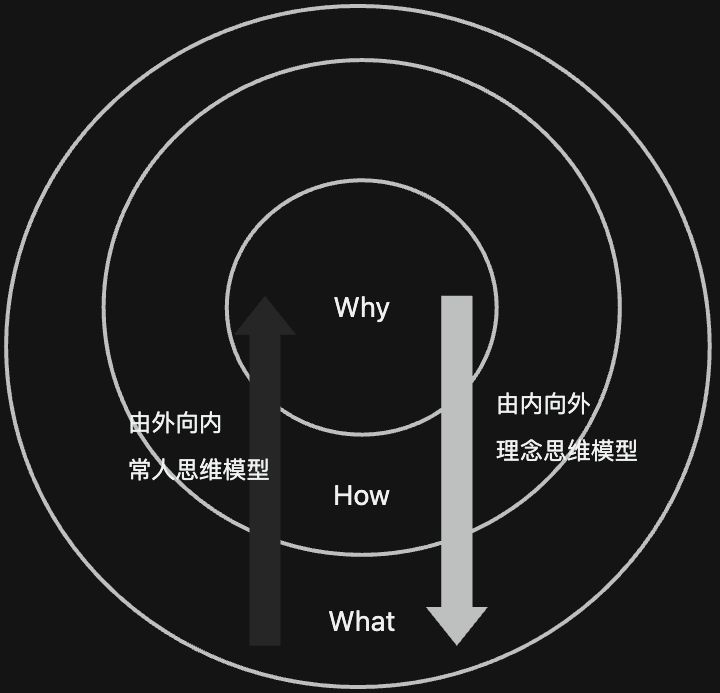

# 【TED】伟大的领导者是如何激励人们行动的

> Simon Sinek TED 演讲笔记

作品核心内容是**黄金圆环模型（Golden Circle）**，圆环从外到内分别为 What（是什么）、How（怎么做）、Why（为什么）三层。

## 两种思维模式

### 常人思维模式：What → How → Why

世界上 100% 的人都明白自己在做什么，其中有部分人明白自己怎么做（独特工艺、独特卖点），但非常少的人和组织明白为什么做，怀着的理念是什么？这种方式从清晰开始，然后走向模糊。

### 理念思维模型：Why → How → What

从理念出发——Why，现在面临的挑战是什么？——How，最终出现具体的载体——What。

从不同的方向出发会指导人们有不同的思考、行动、交流沟通方式。

**苹果的沟通方式：**
> 我们做的每一件事情，都是为了突破和创新。我们挑战现状的方式是通过把我们的产品设计得十分精美，使用简单，和界面友好，我们只是在这个过程中做出了最棒的电脑。

~~成功的要素是：充足的资金、优秀的人才和良好的市场趋势。~~
