技术分析使用的所有工具，如支撑和阻挡水平、价格形态、趋势线等，其唯一的目的都是为了辅助交易者评估市场趋势，从而趋势交易。

# 趋势的定义

趋势就是市场何去何从的方向。

市场不会朝着任何方向直来直去，而是形成明显的波峰和波谷曲折蜿蜒的展现。市场趋势正是由这些波峰和波谷依次上升或依次下降，或者横向延伸其方向所构成。

所以，我们把**上升趋势**定义为一系列依次上升的峰和谷；把**下降趋势**定义为一系列依次下降的峰和谷；把**横向延伸趋势**定义为一系列依次横向伸展的峰和谷。又总结为**趋势的三种方向**。

|                           上升趋势                           |                           下降趋势                           |                         横向延伸趋势                         |
| :----------------------------------------------------------: | :----------------------------------------------------------: | :----------------------------------------------------------: |
| 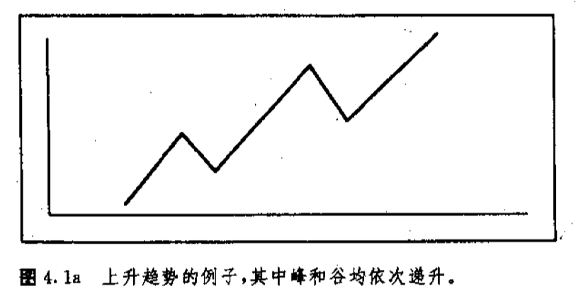 | 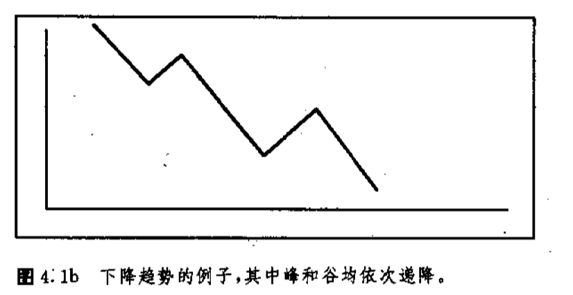 | 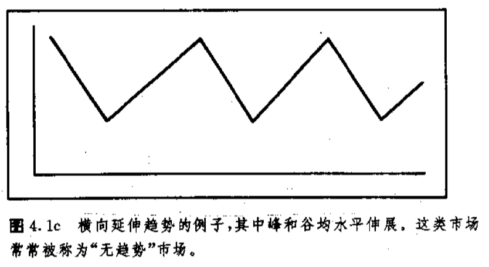 |

# 趋势的三种类型（规模）

趋势不但有三个方向，还可以划分为三种类型，也称为三种持续时间。即主要趋势、次要趋势、短暂趋势。

| 趋势层级 | 传统市场（股票）持续时间 | 币圈持续时间                       | 常用周期图（币圈） | 典型特征（币圈）                                             |
| -------- | ------------------------ | ---------------------------------- | ------------------ | ------------------------------------------------------------ |
| 主要趋势 | 几个月 → 几年            | 6个月 ～ 3年（极端可到 4 年）      | 周线 / 月线        | 美联储加息/降息、BTC 减半周期、ETF / 大资金入场              |
| 次要趋势 | 几周 → 几个月            | 2 周 ～ 3 个月（常见：**3–6 周**） | 日线               | 主趋势中的**上涨回调 / 下跌反弹** 回撤幅度通常：**牛市回调：20%～40%**；**熊市反弹：15%～30%** |
| 短暂趋势 | 几天 → 几周              | 几小时 ～ 7 天（常见：**1–3 天**） | 15m / 1H / 4H      | 由**资金博弈、新闻、清算、技术位**驱动；高频上下影线多；合约清算最集中的地方 |

币圈=高波动 + 7x24 + 高杆杆，所有周期**明显缩短**。

> [!IMPORTANT]
>
> 币圈实战判断口诀：周线定方向，日线找节奏，小时线找进出

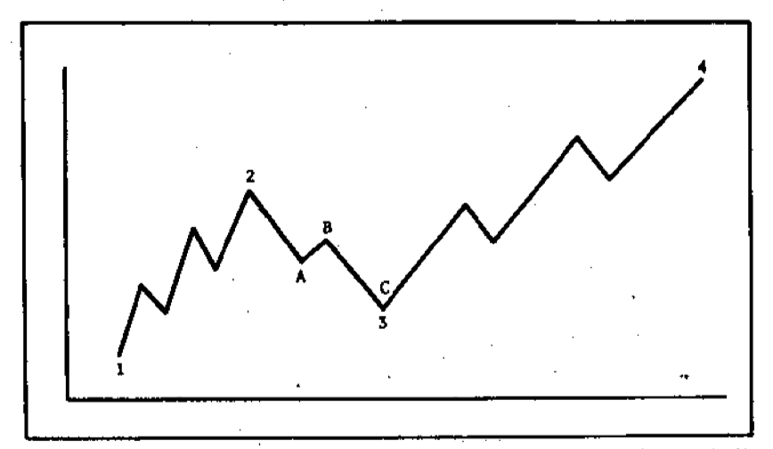

图中展示了三种趋势的规模：点1、2、3、4表示了**主要上升趋势**（上升）。2-3浪代表主要上升趋势中的次要性调整。同时每一个次要浪也可以划分为短暂趋势。次要浪2-3可以分为短浪A-B-C。

# 支撑和阻挡

价格运动是由一系列波峰和波谷构成的，他们一次升降决定了市场的趋势。在整个趋势中关键的峰和谷命名为支撑和阻挡。

| 定义             | 波浪形态               | 多空力量                                                     |
| ---------------- | ---------------------- | ------------------------------------------------------------ |
| 支撑，前一个低点 | 谷,又称“向上反弹低点”  | 在其下方，买方兴趣强大，足已撑拒卖方形成的压力。结果价格在这里停止下跌，回头向上反弹。 |
| 阻挡，前一个高点 | 峰，又称“向下反弹高点” | 于支撑相反，在其上方，卖方压力挡住了买方的推进，于是价格又升转跌。阻挡水位通常以前一个峰值为标志。 |

|                                         | 图                                                           | 描述                                                         |
| --------------------------------------- | ------------------------------------------------------------ | ------------------------------------------------------------ |
| 图a，上升趋势中依次上升的支撑和阻挡水平 | 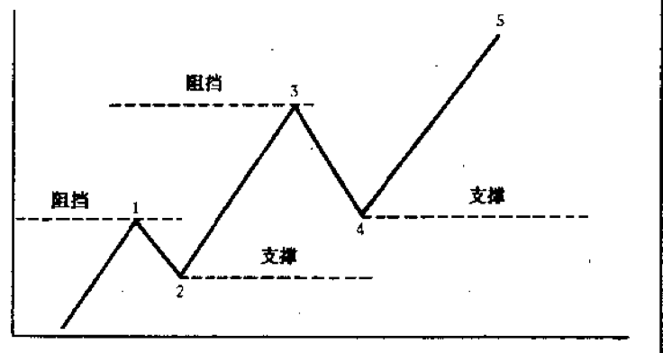 | 点2和4 为支撑水平，通常由过去的向上反弹低点形成。点1和3为阻挡水平，通常以过去的峰为标志。 |
| 图b，下降趋势中的支撑和阻挡水平         | 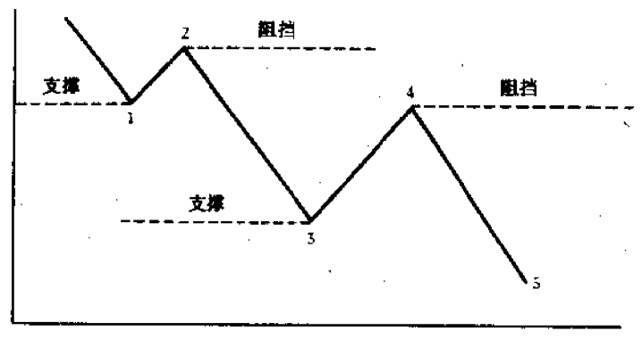 |                                                              |

为了完整地理解趋势理论，我们必须切实领会支撑和阻挡这两个概念。**如果上升趋势要持续下去，每个相继的低点（支撑水平）就必须高过前一个低点**。**每个相继的上冲高点（阻挡水平）也非得高过前一个高点不可**。在上升趋势中，如果新的一轮调整一直下降到前一个低点的水平，这或许就是该上升趋势即将终结、或者至少即将蜕化成横向延伸慈势的先期警讯。如果这个支撑水平被击穿，可能就意味者趋势即将由上升反转为下降。

## 支撑和阻挡水平互换角色

只要支撑或阻挡水平被足够大的价格变化切实地击破了，它们就互换角色，**演变成自身原先的反面**。换言之，阻挡水平就变成了支撑水平，而支撑水平变成了阻挡水平。为了理解其中的奥妙，下面我们先讲一讲形成支撑和阻挡水平的一点心理根由。

**支撑和阻挡心理学**：首先简明起见，市场主要参与者包括多头、空头、观望者三者。

假定市场再支撑区域开始向上移动，多头者很高兴，但可惜么有多增加一些头寸；空头者开始怀疑自己的方向错了，但愿价格回落到他们入市价格脱身；观望者认识到这个价格将进一步上涨，决定下一次是买入的好时间。上述三个群体的买入自然会把价格推上去。

| (趋势反转)形态 | 图表                                                         | 解释                                                         |
| -------------- | ------------------------------------------------------------ | ------------------------------------------------------------ |
| 双重顶         | 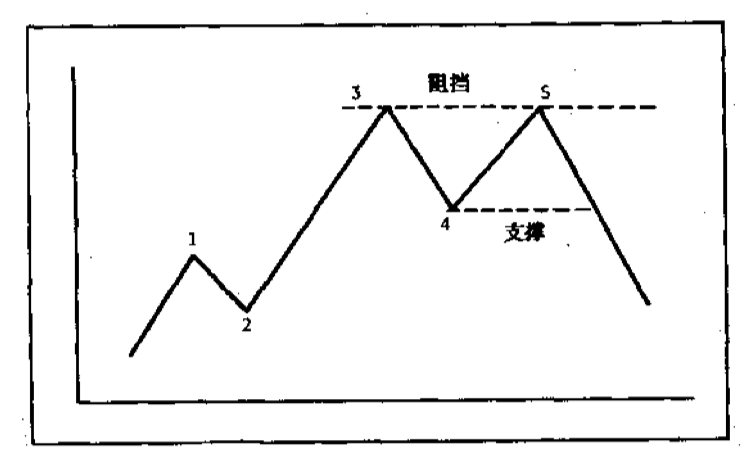 | 点5，价格无力向上超越过去的峰点3，然后又向下跌破了先前的低点4，这就构成了向下的趋势反转。 |
| 双重底         | 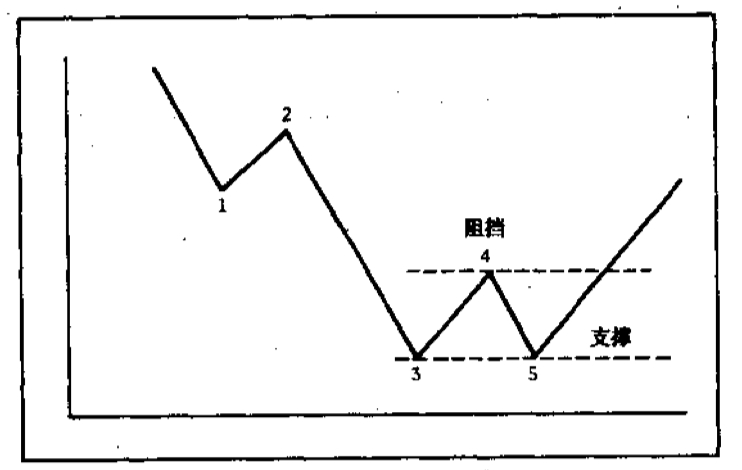 | 形成底部形态的第一个征兆是价格在点5能够维持在先前的低点3之上，而当价格向上穿越了先前的峰点4，这个底部形态就得到了验证。 |

当支撑/阻挡区域越频繁，该区域越重要。

**决定支撑和阻挡区域重要程度三个方面：**市场再该处所经历的时间、交易量、以及交易活动时间距离当前的远近。

现在反过来，市场是下降趋势，且跌破了前一个支撑区域，这时候多头认识到方向错了，他们得补足保证金或平掉多头头寸。原本造就支撑区域的，是在其下方占压倒多数的买进指令，而现在所有买进指令全部转化成位于其上方的卖出指令。这一来，支撑就转变为阻挡。原先的支撑区越重要——就是说，那里的交易越活断，距
目前越接近——那么，现在的阻挡潜力便越强大。上述三种人—多头者，空头者，和观望者—-当初造就支撑的所有动因，现在恰好反过来，为以后的价格上冲或者弹升压上了一个盖子。

穿越程度：支撑水平被市场穿越到一定程度之后，就转化为阻挡水平，反之亦然。

价格从支撑或阻挡水平弹开的距离越大，则该支撑或阻挡的重要程度越强。

度量穿越程度，有图表分析师以穿越幅度达10%作为标准，短线则3%到5%。

| 趋势 | 上升                                                         | 下降                                                         |
| ---- | ------------------------------------------------------------ | ------------------------------------------------------------ |
| 图表 | 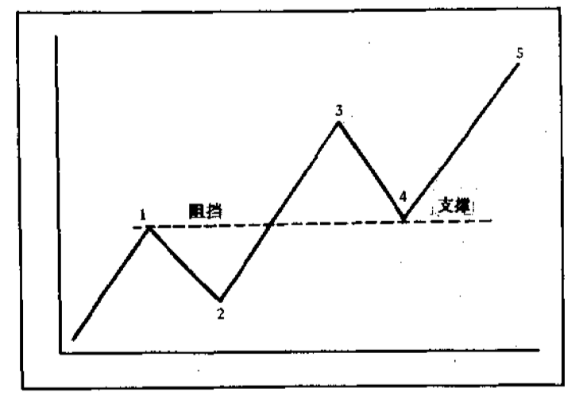 | 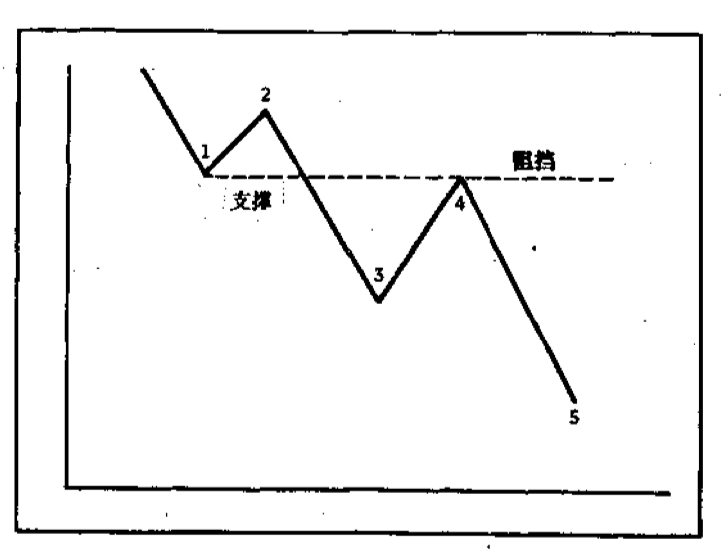 |
| 描述 | 在上升趋势中，当阻挡水平被市场以足够大的幅度向上穿越后，就演变为支撑水平。注意，一旦点1处的阻挡被击被，它就在点4处构成了支擇。先前的妳值在以后的市场调整中将起到支撑作用。 | 在下降趋势中，如果支撑水平被跌破，则演化为阻挡水平。请注意，点1过去是支撑，现在变成了点4处的阻挡。 |

## 习惯数值判别支撑和阻挡

市场倾向于在习惯数上停止上升或下跌。交易商总喜欢以一些重要的习惯数，比如 10,20,25,50,75,100（以及100的整数倍），作为价格目标，并相应地采取措施。因而这些习惯数常常成为“心理上的”支撑或阻挡水平。根据这个常识，交易者可以在市场接近某个重要习惯数时平仓了结，实现利润。

**买盘（多头）的保护指令应低于习惯数，而卖盘（空头）的保护指令应高于习惯数**。市场遵循习惯数，特别是这些较重要习惯数的倾向，是其特征之一，这一特征对期货交易颇有助益，因此技术型交易商应该把它热记于心。

止盈指令，多头止盈指令低于习惯数，空头止盈指令高于习惯数。

入场指令则相反，多头入场指令高于习惯数，空头入场指令低于习惯数。

# 趋势线

上升趋势线是沿着相继的向上反弹低点联结而成的一条直线，位于相应的价格图线的下侧。

下降趋势线是沿著相继的上冲高点联结而成的，位于价格上侧。

趋势线的做法：

| 上升趋势线                                                   | 下降趋势线                                                   |
| ------------------------------------------------------------ | ------------------------------------------------------------ |
| 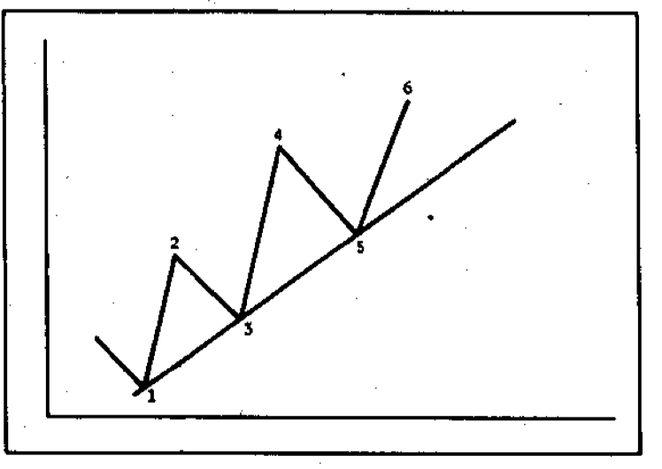 | 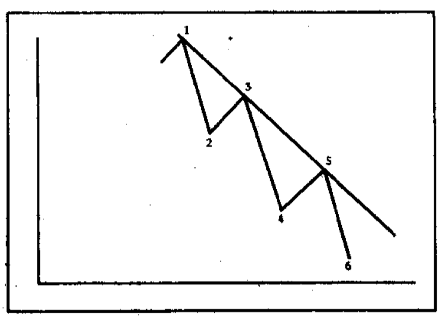 |
| 上升趋勢线的图例。上升趋勢线是由依次上升的向上反弹低点连接而成的。首先在两个相继的依次上升的低点（点1和3）之下作出尝试性趋势线，然后还需要第三个点（点5）来确认该趋势线的有效性。 | 下降趋势线是通过连接依次下降的上冲高点作出的。先由两点（点1和3）作出尝试性下降趋势线，然后通过第三点（点5）验证其有效性。 |

通过两点还只是画出“试验趋势线”，为了验证其有效果性，必须看到价格第三次触及该线，并反弹出去。
归纳起来，我们首先必须有两点方可作出趋势线，然后用第三个点来验证其有效性。

确认趋势线的重要程度：它包容的**时间越长，**所经历**试探的次数越多，**则越重要。

比如说，有条趋势线成功地经受了8次试探，从而连续8次地显示了自身的有效性，那么它显然比另一条只经受了3次试探的趋势线基要。另一方面，一条持续有效达9个月之久的趋势线，当然比另一条只有：个星期乃至9天有效历史的趋势线更要。趋势线的要性越强，由其引发的信心就越大，那么它的突破也就越具重要影响。

