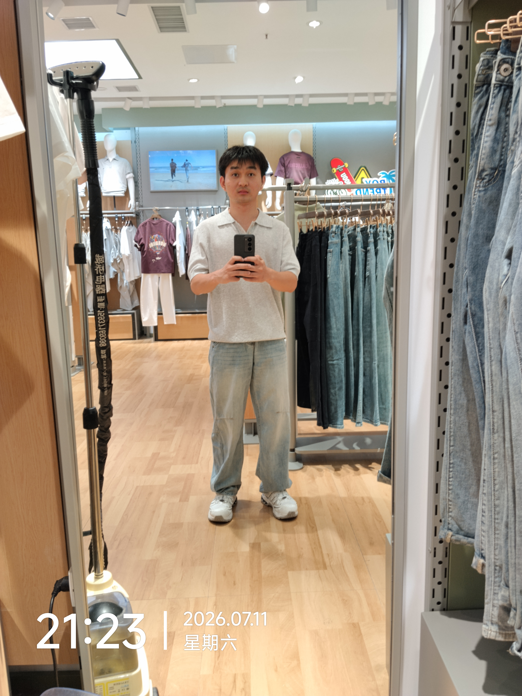

26岁谭金磊：

&emsp;&emsp;你好！

&emsp;&emsp;截止今天毕业入职一年零十四天了。经过这一年的工作，现在面对突然打来的工作会议不会那么慌张了，认识到工作中慌张来源于对业务逻辑的认知模糊，自信、底气来自于对涉及业务逻辑的足够了解。

&emsp;&emsp;《⾮线性成长：不确定时代下的职业发展和商业通关策略》书中说，看一个人在行业中能不能有所成就，头三年最重要，头三年就能得到结果。26岁7月份是你毕业的满3年，你是前端负责人了吗？还是说你应该成为项目负责人了？还是你已经转行了？

&emsp;&emsp;根据人的基本需求衣穿住行，类比人生所有的事应该可以总结为健康、婚姻、赚钱三个维度。健康方面，我开始学着好好打理自己，使用防晒霜，学着使用素颜霜和做头发，还有跑步消耗400～500大卡热量，让自己脸能瘦下来，这周发现跑步时的体能和耐力有提高，腰疼也有很大的缓解，而且心情也舒坦很多。只是赚钱的能力没有进步，也没有方向，更别提规划了。婚姻方面，没怎么花心思，身边女孩子少，目前又没有能力去尝试接触更多的女孩子，这个我想既然不是自己想就成的，我就先种花——提高自己的颜值，打理脸、头发、提高衣品——来做前期的准备，即使还是没有，把自己打理好了，自己心情也美丽。

&emsp;&emsp;图片是在郑州二七广场一家服装店试穿时拍的，挺喜欢的，最终买下来了。

&emsp;&emsp;此致

敬礼

24岁谭金磊

2026年7月16日

